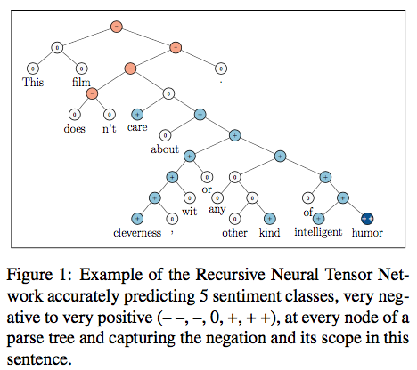
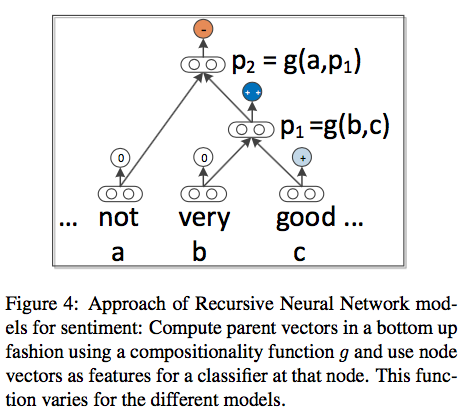
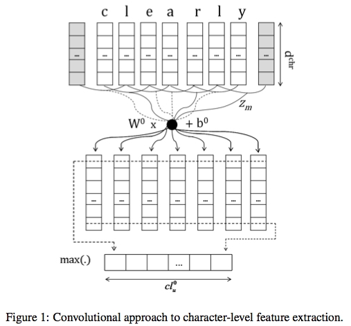
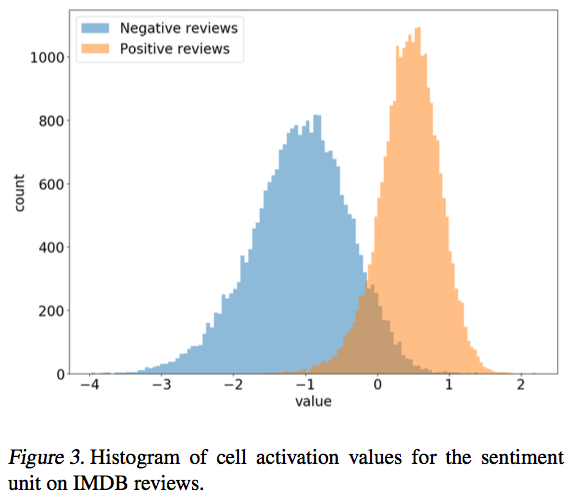

# Annotated bibliography for short-text sentiment analysis
Davey Proctor

## Datasets and evaluation
- Stanford Twitter Sentiment Corpus (STS) 
- Stanford Sentiment Treebank (SSTb) [[paper](https://nlp.stanford.edu/~socherr/EMNLP2013_RNTN.pdf)] [[website](https://nlp.stanford.edu/sentiment/treebank.html)]
- Survey paper of evaluation methods [[paper](http://ceur-ws.org/Vol-1096/paper1.pdf)]

## Using linguistic information
Several papers use linguistic information even in short texts to help improve label prediction accuracy.

--

[**Twitter Sentiment Analysis: The Good the Bad and the OMG!**](http://www.aaai.org/ocs/index.php/ICWSM/ICWSM11/paper/download/2857/3251?height%3D90%%26iframe%3Dtrue%26width%3D90%)
Efthymios Kouloumpis, Theresa Wilson, Johanna Moore (AAAI, 2011)

Surveys the utility of linguistic features towards the goal of Twitter sentiment analysis. Deploys existing lexical tools such as lexicon features and part of speech features. Also uses emoticons and hashtags to extend supervised dataset.

--

[**Recursive Deep Models for Semantic Compositionality Over a Sentiment Treebank**](https://nlp.stanford.edu/~socherr/EMNLP2013_RNTN.pdf)
Richard Socher, Alex Perelygin, Jean Y. Wu, Jason Chuang, Christopher D. Manning, Andrew Y. Ng and Christopher Potts (EMNLP, 2013)

Deploys a recursive neural network to address the problem of long term dependencies and compositionality of phrases into sentence-long sentiment. They use the [Stanford Parser](https://nlp.stanford.edu/software/lex-parser.shtml) to find words and phrases that intuitively "govern" over subphrases; the recursive neural network models composed meaning over these subphrases. Below is shown a visual of the data and the compositional model.

## Methods initially ignorant of linguistic information
The following methods use supervised labels to learn class predictions, as the above; however, they do not directly integrate any linguistic information above the characters/words in the texts.

--

[**Deep Convolutional Neural Networks for Sentiment Analysis of Short Texts**](http://anthology.aclweb.org/C/C14/C14-1008.pdf)
Cicero Nogueira dos Santos, Maira Gatti (COLING, 2014)

Uses a convolutional network over characters and words with pretrained embeddings to beat the state of the art both on the STS and SSTb datasets.

--

[**Character-level Convolutional Networks for Text Classification**](https://papers.nips.cc/paper/5782-character-level-convolutional-networks-for-text-classification.pdf)
Xiang Zhang, Junbo Zhao, Yann LeCun (NIPS 2015)

Surveys the use of fully-character views of data towards general text classification problems, including sentiment analysis. It finds that character convolutional networks can achieve competitive results, benefiting from being able to understand odd-vocabulary elements such as emoticons naturally. They come up short unpredictably accross the different tasks; therefore the authors conclude that they should be thought of as another tool in an ensemble of approaches towards problems in this domain.

The authors were motivated by a signals-processing view on language, in which language is represented by a sequence of bytes or characters.

--

[**Learning to Generate Reviews and Discovering Sentiment**](https://arxiv.org/pdf/1704.01444.pdf)
Alec Radford, Rafal Jozefowicz, Ilya Sutskever (2017)

Approaches sentiment analysis as an unsupervised language modeling problem. They train a multiplicative LSTM on the Amazon product review dataset introduced in [McAuley et al. 2015](https://cseweb.ucsd.edu/~jmcauley/pdfs/kdd15.pdf). They test on a variety of application domains, including SSTb. Inuitively, their model performs best on data sets most similar to that on which they trained their model. Most interestingly, they find a single scalar unit which predicts review sentiment, and by holding it fixed, they can generate intuitively positive or negative text.

