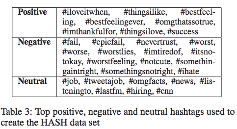

# Annotated bibliography for short-text sentiment analysis
Davey Proctor

## Datasets and evaluation
- Stanford Twitter Sentiment Corpus (STS) 
- Stanford Sentiment Treebank (SSTb) [[paper](https://nlp.stanford.edu/~socherr/EMNLP2013_RNTN.pdf)] [[website](https://nlp.stanford.edu/sentiment/treebank.html)]
- Survey paper of evaluation methods [[paper](http://ceur-ws.org/Vol-1096/paper1.pdf)]

## Using linguistic information
Several papers use linguistic information even in short texts to help improve label prediction accuracy.

--

[**Twitter Sentiment Analysis: The Good the Bad and the OMG!**](http://www.aaai.org/ocs/index.php/ICWSM/ICWSM11/paper/download/2857/3251?height%3D90%%26iframe%3Dtrue%26width%3D90%)
Efthymios Kouloumpis, Theresa Wilson, Johanna Moore (AAAI, 2011)

Surveys the utility of linguistic features towards the goal of Twitter sentiment analysis. Deploys existing lexical tools such as lexicon features and part of speech features. Also uses emoticons and hashtags to extend supervised dataset.

--

## Methods initially ignorant of linguistic information
The following methods use supervised labels to learn class predictions, as the above; however, they do not directly integrate any linguistic information above the characters/words in the texts.

--

[**Deep Convolutional Neural Networks for Sentiment Analysis of Short Texts**](http://anthology.aclweb.org/C/C14/C14-1008.pdf)
C'{i}cero Nogueira dos Santos, Ma'{i}ra Gatti (COLING, 2014)

Uses a convolutional network over characters and words with pretrained embeddings to beat the state of the art both on the STS and SSTb datasets.

--
